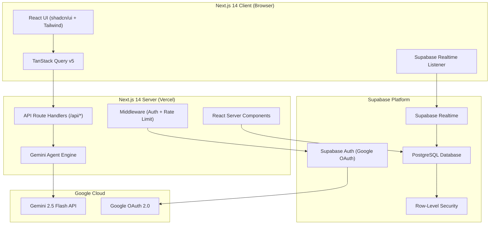
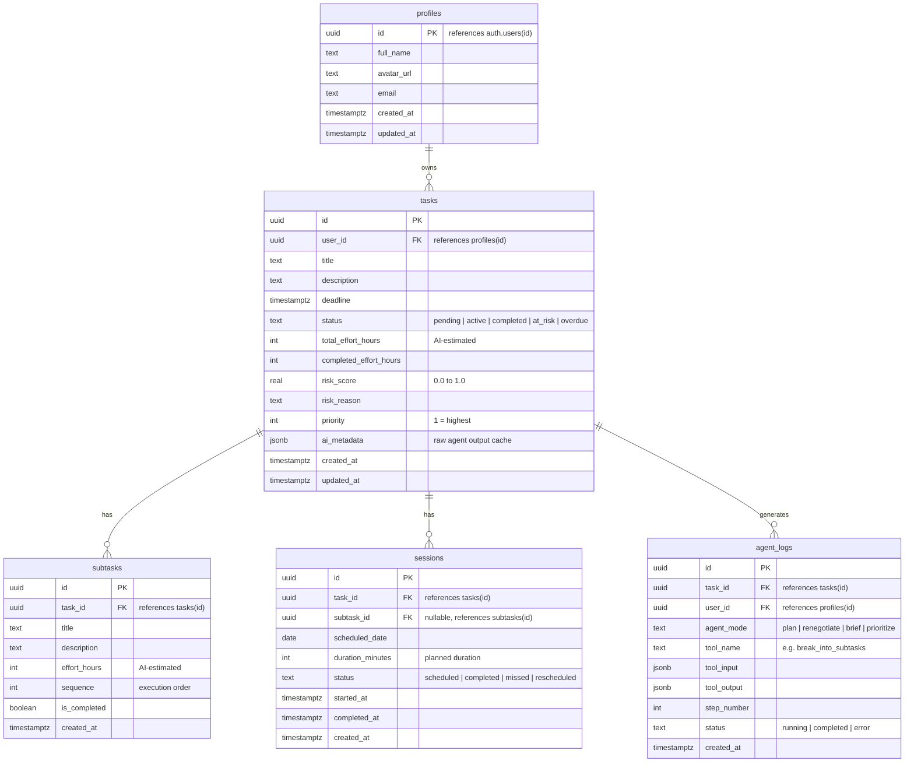
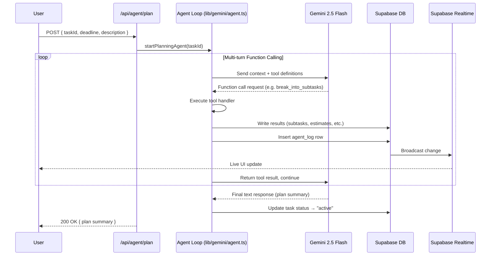
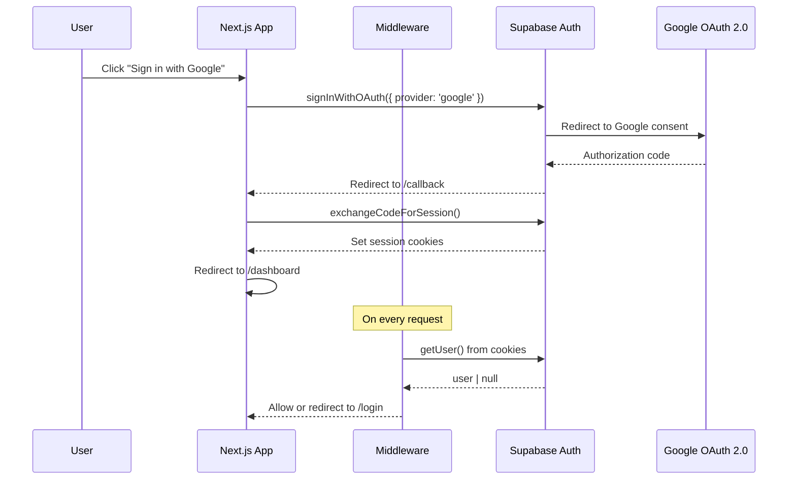
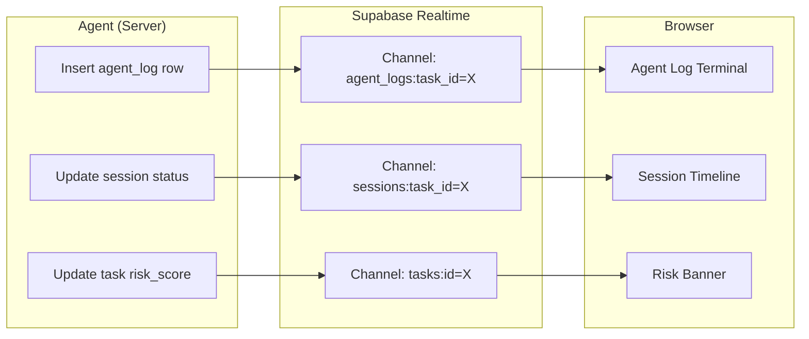
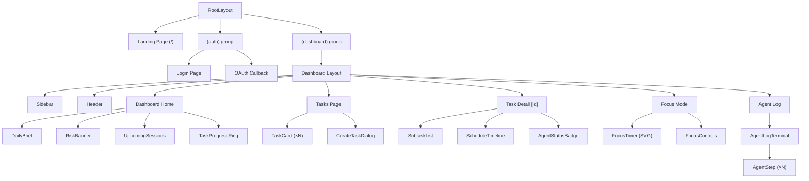
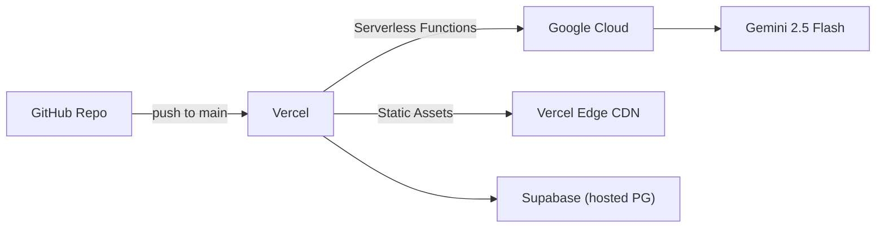

# CrunchAI — Detailed System Architecture

AI-powered deadline agent that plans, schedules, and renegotiates your work automatically. Built for **BlockseBlock Hackathon 2026**.

---

## 1. High-Level System Diagram



---

## 2. Technology Stack Summary

| Layer | Technology | Purpose |
|---|---|---|
| Framework | Next.js 14 (App Router, RSC) | Full-stack React framework |
| Language | TypeScript (strict) | Type-safe development |
| Styling | Tailwind CSS + shadcn/ui | Utility-first CSS + accessible components |
| State / Fetching | TanStack Query v5 | Server state management, caching, mutations |
| Database | Supabase PostgreSQL | Primary data store |
| Auth | Supabase Auth (Google OAuth 2.0) | Authentication + session management |
| Realtime | Supabase Realtime | Live UI updates for agent activity |
| AI | Google Gemini 2.5 Flash | Function calling, structured output, NL briefs |
| Validation | Zod | Runtime schema validation on API payloads |
| Deployment | Vercel (Google Cloud infra) | Serverless deployment |

---

## 3. Directory Structure

```
crunchai/
├── app/                              # Next.js App Router
│   ├── layout.tsx                    # Root layout (providers, fonts, metadata)
│   ├── page.tsx                      # Landing / marketing page
│   ├── globals.css                   # Tailwind base + custom tokens
│   ├── (auth)/                       # Auth route group
│   │   ├── login/page.tsx            # Google OAuth sign-in page
│   │   └── callback/route.ts        # OAuth callback handler
│   ├── (dashboard)/                  # Authenticated route group
│   │   ├── layout.tsx                # Dashboard shell (sidebar, header)
│   │   ├── page.tsx                  # Dashboard home — daily brief + overview
│   │   ├── tasks/
│   │   │   ├── page.tsx              # Task list view
│   │   │   └── [id]/page.tsx         # Single task detail + subtasks + schedule
│   │   ├── focus/
│   │   │   └── page.tsx              # Focus mode (fullscreen timer)
│   │   └── agent-log/
│   │       └── page.tsx              # Agent thinking log (terminal-style)
│   └── api/                          # API Route Handlers
│       ├── agent/
│       │   ├── plan/route.ts         # POST — Trigger planning agent
│       │   ├── renegotiate/route.ts  # POST — Trigger renegotiation agent
│       │   ├── brief/route.ts        # GET  — Generate AI daily brief
│       │   └── prioritize/route.ts   # POST — Re-prioritize all tasks
│       ├── tasks/
│       │   ├── route.ts              # GET/POST — CRUD tasks
│       │   └── [id]/
│       │       ├── route.ts          # GET/PUT/DELETE — Single task
│       │       └── sessions/route.ts # PUT — Complete/miss a session
│       └── webhooks/
│           └── supabase/route.ts     # Supabase DB webhook listener
├── components/
│   ├── ui/                           # shadcn/ui primitives (button, card, etc.)
│   ├── dashboard/
│   │   ├── daily-brief.tsx           # AI-generated daily briefing card
│   │   ├── risk-banner.tsx           # At-risk task alerts
│   │   ├── task-progress-ring.tsx    # SVG circular progress
│   │   └── upcoming-sessions.tsx     # Today's scheduled sessions
│   ├── tasks/
│   │   ├── task-card.tsx             # Task summary card
│   │   ├── subtask-list.tsx          # Subtask checklist
│   │   ├── schedule-timeline.tsx     # Day-by-day schedule visualization
│   │   └── create-task-dialog.tsx    # New task form (name, deadline, effort)
│   ├── focus/
│   │   ├── focus-timer.tsx           # SVG countdown timer
│   │   └── focus-controls.tsx        # Complete / Miss / Pause buttons
│   ├── agent/
│   │   ├── agent-log-terminal.tsx    # Terminal-style thinking log
│   │   ├── agent-step.tsx            # Single tool-call step in log
│   │   └── agent-status-badge.tsx    # Running / Idle / Error badge
│   └── layout/
│       ├── sidebar.tsx               # Navigation sidebar
│       ├── header.tsx                # Top bar with user avatar
│       └── providers.tsx             # Client providers (QueryClient, Supabase, Theme)
├── lib/
│   ├── supabase/
│   │   ├── client.ts                 # Browser Supabase client (@supabase/ssr)
│   │   ├── server.ts                 # Server Supabase client (cookies)
│   │   ├── middleware.ts             # Auth session refresh middleware
│   │   └── types.ts                  # Generated DB types (supabase gen types)
│   ├── gemini/
│   │   ├── client.ts                 # Gemini SDK initialization
│   │   ├── agent.ts                  # Core agent loop (function-calling orchestrator)
│   │   ├── tools.ts                  # Tool definitions (6 functions)
│   │   ├── tool-handlers.ts          # Tool execution handlers
│   │   ├── prompts.ts                # System prompts for each agent mode
│   │   └── schemas.ts                # Zod schemas for structured output
│   ├── hooks/
│   │   ├── use-tasks.ts              # TanStack Query hooks for tasks
│   │   ├── use-agent.ts              # Agent status + realtime log subscription
│   │   ├── use-focus.ts              # Focus timer state machine
│   │   └── use-daily-brief.ts        # Daily brief fetcher
│   ├── utils/
│   │   ├── schedule.ts               # Date math, working-day calculations
│   │   ├── risk.ts                   # Risk scoring logic
│   │   └── format.ts                 # Date/time formatters
│   └── validators/
│       └── task.ts                   # Zod schemas for task API payloads
├── middleware.ts                      # Next.js edge middleware (auth guard)
├── supabase/
│   ├── migrations/                   # SQL migration files
│   └── seed.sql                      # Dev seed data
├── public/                           # Static assets
├── tailwind.config.ts
├── next.config.ts
├── tsconfig.json
├── package.json
└── .env.local                        # Supabase URL, anon key, Gemini key
```

---

## 4. Database Schema (Supabase PostgreSQL)



### SQL Migration (Core)

```sql
-- Enable UUID generation
create extension if not exists "pgcrypto";

-- Profiles (synced from auth.users via trigger)
create table public.profiles (
  id uuid primary key references auth.users(id) on delete cascade,
  full_name text,
  avatar_url text,
  email text,
  created_at timestamptz default now(),
  updated_at timestamptz default now()
);

-- Tasks
create table public.tasks (
  id uuid primary key default gen_random_uuid(),
  user_id uuid not null references public.profiles(id) on delete cascade,
  title text not null,
  description text,
  deadline timestamptz not null,
  status text not null default 'pending'
    check (status in ('pending','active','completed','at_risk','overdue')),
  total_effort_hours int,
  completed_effort_hours int default 0,
  risk_score real default 0.0,
  risk_reason text,
  priority int default 99,
  ai_metadata jsonb default '{}'::jsonb,
  created_at timestamptz default now(),
  updated_at timestamptz default now()
);

-- Subtasks
create table public.subtasks (
  id uuid primary key default gen_random_uuid(),
  task_id uuid not null references public.tasks(id) on delete cascade,
  title text not null,
  description text,
  effort_hours int not null default 1,
  sequence int not null default 0,
  is_completed boolean default false,
  created_at timestamptz default now()
);

-- Sessions (work blocks)
create table public.sessions (
  id uuid primary key default gen_random_uuid(),
  task_id uuid not null references public.tasks(id) on delete cascade,
  subtask_id uuid references public.subtasks(id) on delete set null,
  scheduled_date date not null,
  duration_minutes int not null default 60,
  status text not null default 'scheduled'
    check (status in ('scheduled','completed','missed','rescheduled')),
  started_at timestamptz,
  completed_at timestamptz,
  created_at timestamptz default now()
);

-- Agent Logs
create table public.agent_logs (
  id uuid primary key default gen_random_uuid(),
  task_id uuid not null references public.tasks(id) on delete cascade,
  user_id uuid not null references public.profiles(id) on delete cascade,
  agent_mode text not null
    check (agent_mode in ('plan','renegotiate','brief','prioritize')),
  tool_name text not null,
  tool_input jsonb default '{}'::jsonb,
  tool_output jsonb default '{}'::jsonb,
  step_number int not null default 0,
  status text not null default 'running'
    check (status in ('running','completed','error')),
  created_at timestamptz default now()
);

-- Indexes
create index idx_tasks_user_id on public.tasks(user_id);
create index idx_tasks_deadline on public.tasks(deadline);
create index idx_tasks_status on public.tasks(status);
create index idx_subtasks_task_id on public.subtasks(task_id);
create index idx_sessions_task_id on public.sessions(task_id);
create index idx_sessions_date on public.sessions(scheduled_date);
create index idx_agent_logs_task_id on public.agent_logs(task_id);

-- RLS Policies
alter table public.profiles enable row level security;
alter table public.tasks enable row level security;
alter table public.subtasks enable row level security;
alter table public.sessions enable row level security;
alter table public.agent_logs enable row level security;

create policy "Users can view own profile"
  on public.profiles for select using (auth.uid() = id);
create policy "Users can update own profile"
  on public.profiles for update using (auth.uid() = id);

create policy "Users can CRUD own tasks"
  on public.tasks for all using (auth.uid() = user_id);

create policy "Users can CRUD subtasks of own tasks"
  on public.subtasks for all
  using (task_id in (select id from public.tasks where user_id = auth.uid()));

create policy "Users can CRUD sessions of own tasks"
  on public.sessions for all
  using (task_id in (select id from public.tasks where user_id = auth.uid()));

create policy "Users can view own agent logs"
  on public.agent_logs for select using (auth.uid() = user_id);
create policy "System can insert agent logs"
  on public.agent_logs for insert with check (auth.uid() = user_id);

-- Enable Realtime on agent_logs and sessions
alter publication supabase_realtime add table public.agent_logs;
alter publication supabase_realtime add table public.sessions;
alter publication supabase_realtime add table public.tasks;
```

---

## 5. Gemini Agent Architecture

The core innovation is a **multi-turn function-calling loop** where Gemini acts as the orchestrator, deciding which tools to call, in what order, and with what arguments.



### 6 Registered Tool Definitions

| Tool Name | Input | Output | Purpose |
|---|---|---|---|
| `break_into_subtasks` | `{ title, description, deadline }` | `{ subtasks: [{ title, description }] }` | Decompose a task into ordered subtasks |
| `estimate_effort` | `{ subtasks: [{ title, description }] }` | `{ subtasks: [{ title, effort_hours }] }` | Estimate hours per subtask |
| `calculate_schedule` | `{ subtasks, deadline, available_days }` | `{ sessions: [{ date, subtask, duration }] }` | Build day-by-day session schedule |
| `assess_risk` | `{ subtasks, sessions, deadline }` | `{ risk_score, risk_reason, bottleneck_days }` | Flag risks and bottleneck days |
| `rebalance_plan` | `{ sessions, missed_sessions, deadline }` | `{ new_sessions, dropped_subtasks? }` | Rebuild schedule after missed sessions |
| `prioritize_tasks` | `{ tasks: [{ id, deadline, risk, progress }] }` | `{ ranked: [{ id, priority, reason }] }` | Rank tasks by urgency across the board |

### Agent Modes

| Mode | Trigger | Tools Available | Route |
|---|---|---|---|
| **Plan** | User creates a task | All 6 tools | `POST /api/agent/plan` |
| **Renegotiate** | Session marked as "missed" | `rebalance_plan`, `assess_risk` | `POST /api/agent/renegotiate` |
| **Brief** | Dashboard load (daily) | None — pure NL generation | `GET /api/agent/brief` |
| **Prioritize** | Multiple tasks exist, any change | `prioritize_tasks`, `assess_risk` | `POST /api/agent/prioritize` |

---

## 6. Authentication Flow



### Key Implementation Details

- **`@supabase/ssr`** for cookie-based session management (no localStorage)
- **Middleware** (`middleware.ts`) refreshes session on every request and protects `/(dashboard)/*` routes
- **Profile sync**: Supabase trigger creates a `profiles` row on `auth.users` insert
- **Server-side client** uses `cookies()` from `next/headers` for RSC data fetching

---

## 7. Realtime Architecture

Supabase Realtime provides instant UI updates when the agent writes to the database.



### Subscription Pattern

```typescript
// lib/hooks/use-agent.ts
const channel = supabase
  .channel(`agent:${taskId}`)
  .on('postgres_changes', {
    event: 'INSERT',
    schema: 'public',
    table: 'agent_logs',
    filter: `task_id=eq.${taskId}`
  }, (payload) => {
    // Append new step to agent log UI
    queryClient.setQueryData(['agent-log', taskId], (old) => [...old, payload.new]);
  })
  .subscribe();
```

---

## 8. Core User Flows

### Flow 1: Create Task → Agent Plans

```
User fills form (title, deadline, description)
  → POST /api/tasks (create task row, status=pending)
  → POST /api/agent/plan { taskId }
  → Agent loop runs:
      1. break_into_subtasks → writes subtask rows
      2. estimate_effort → updates subtask effort_hours
      3. calculate_schedule → writes session rows
      4. assess_risk → updates task risk_score
  → Task status → "active"
  → UI updates live via Realtime
```

### Flow 2: Focus Session → Complete / Miss

```
User opens Focus Mode for a session
  → Full-screen SVG timer starts counting down
  → User clicks "Complete":
      → PUT /api/tasks/{id}/sessions (status=completed)
      → Update completed_effort_hours
      → Mark subtask complete if all sessions done
  → User clicks "Miss":
      → PUT /api/tasks/{id}/sessions (status=missed)
      → POST /api/agent/renegotiate { taskId, missedSessionId }
      → Agent runs rebalance_plan → new sessions created
      → Agent runs assess_risk → updated risk score
      → UI updates via Realtime
```

### Flow 3: Daily Brief

```
User opens Dashboard
  → GET /api/agent/brief
  → Server fetches today's sessions, at-risk tasks, priorities
  → Sends context to Gemini (no function calling, pure NL)
  → Returns personalized markdown brief
  → Rendered in daily-brief.tsx
```

---

## 9. API Route Design

| Method | Route | Purpose | Auth |
|---|---|---|---|
| `GET` | `/api/tasks` | List user's tasks | ✅ |
| `POST` | `/api/tasks` | Create new task | ✅ |
| `GET` | `/api/tasks/[id]` | Get task with subtasks + sessions | ✅ |
| `PUT` | `/api/tasks/[id]` | Update task fields | ✅ |
| `DELETE` | `/api/tasks/[id]` | Delete task and cascade | ✅ |
| `PUT` | `/api/tasks/[id]/sessions` | Mark session complete/missed | ✅ |
| `POST` | `/api/agent/plan` | Trigger planning agent | ✅ |
| `POST` | `/api/agent/renegotiate` | Trigger renegotiation | ✅ |
| `GET` | `/api/agent/brief` | Generate daily brief | ✅ |
| `POST` | `/api/agent/prioritize` | Re-prioritize all tasks | ✅ |

All routes validate input with **Zod**, return consistent error shapes, and use the **server-side Supabase client** (inheriting RLS).

---

## 10. Component Architecture



---

## 11. State Management Strategy

| Concern | Solution | Rationale |
|---|---|---|
| Server data (tasks, sessions) | TanStack Query v5 | Cache, background refetch, optimistic updates |
| Realtime updates | Supabase Realtime → `queryClient.setQueryData` | Merge live changes into TQ cache |
| Auth state | Supabase `onAuthStateChange` → React context | Session is cookie-based, context for UI |
| Focus timer | `useReducer` local state | Ephemeral, no persistence needed |
| UI state (modals, sidebar) | `useState` / URL search params | Simple, co-located |

---

## 12. Auto-Renegotiation Logic

The renegotiation agent fires automatically when a session is marked as "missed":

```
1. Fetch all remaining sessions for the task (status = "scheduled")
2. Fetch the missed session details
3. Calculate remaining effort = total_effort - completed_effort
4. Call Gemini with `rebalance_plan`:
   - Input: remaining sessions, missed session, deadline, remaining effort
   - Gemini redistributes work across available days
   - May increase session durations or add weekend sessions
   - May flag if deadline is no longer achievable
5. Delete old scheduled sessions, insert new ones
6. Call `assess_risk` with new schedule
7. Update task risk_score and risk_reason
8. If risk_score > 0.8 → set task status to "at_risk"
```

> [!IMPORTANT]
> The renegotiation is **fully automatic** — no user action required. The moment a session is missed, the plan rebuilds itself.

---

## 13. Risk Detection Algorithm

```
Risk factors (weighted):
  - Time pressure     = (effort_remaining_hours) / (hours_until_deadline) × 0.4
  - Completion rate    = (1 - completed_sessions / total_sessions) × 0.3  
  - Missed sessions    = (missed_count / total_sessions) × 0.2
  - Bottleneck days    = (days_with_3+_hours_work / remaining_days) × 0.1

risk_score = clamp(weighted_sum, 0.0, 1.0)

Thresholds:
  - risk_score ≥ 0.8  → status = "at_risk", banner shown
  - risk_score ≥ 0.5  → warning indicator on task card
  - risk_score < 0.5  → on track
```

---

## 14. Environment Variables

```bash
# .env.local
NEXT_PUBLIC_SUPABASE_URL=https://xxx.supabase.co
NEXT_PUBLIC_SUPABASE_ANON_KEY=eyJ...
SUPABASE_SERVICE_ROLE_KEY=eyJ...       # Server-only, for agent writes
GEMINI_API_KEY=AI...                   # Google AI Studio key
NEXT_PUBLIC_APP_URL=http://localhost:3000
```

---

## 15. Deployment Architecture



- **Vercel**: Auto-deploy on push, serverless API routes, edge middleware
- **Supabase**: Managed PostgreSQL, Auth, Realtime — no self-hosting
- **Gemini**: Called from serverless functions only (API key never exposed to client)

---

## 16. Security Considerations

| Concern | Mitigation |
|---|---|
| API key exposure | Gemini key is server-only (`GEMINI_API_KEY`, no `NEXT_PUBLIC_`) |
| Data isolation | Supabase RLS on every table — users see only their data |
| Auth bypass | Middleware checks session on all `/(dashboard)` routes |
| Input validation | Zod schemas validate every API payload before DB writes |
| CSRF | Supabase Auth uses `httpOnly` + `SameSite` cookies |
| Rate limiting | Edge middleware rate-limits agent endpoints (10 req/min) |

---

## Open Questions

> [!IMPORTANT]
> **Working hours configuration**: Should the schedule respect user-defined working hours (e.g., 9am–6pm), or assume full-day availability? This affects `calculate_schedule` output significantly.

> [!IMPORTANT]
> **WhatsApp notifications**: The AGENTS.md mentions a `whatsapp-cloud-api` skill. Should CrunchAI send WhatsApp reminders for upcoming sessions or risk alerts? This would require a Meta Business account setup.

> [!NOTE]
> **Multi-task balancing**: When a user has multiple active tasks, should the agent automatically interleave sessions across tasks on the same day, or keep days focused on single tasks?

---

## Verification Plan

### Automated Tests
- `npx vitest run` — Unit tests for schedule calculation, risk scoring, and Zod schemas
- `npx playwright test` — E2E tests for auth flow, task creation, focus mode, and agent log rendering

### Manual Verification
- Create a task → verify subtasks, sessions, and risk score appear via Realtime
- Miss a session → verify renegotiation fires automatically and schedule rebuilds
- Open dashboard → verify daily brief renders correctly
- Sign in/out → verify auth flow and route protection
