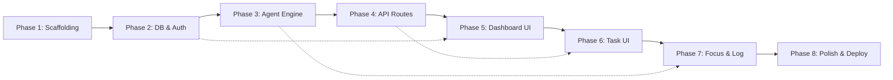

# CrunchAI — Phase-Wise Implementation Plan

> Derived from [architecture.md](file:///c:/Users/ARYAN/vibe-ship/crunchai/docs/architecture.md) and [problem statement.md](file:///c:/Users/ARYAN/vibe-ship/crunchai/docs/problem%20statement.md)

---

## Overview

| Phase | Name | Est. Time | Dependencies |
|---|---|---|---|
| 1 | Project Scaffolding & Config | ~1 hr | None |
| 2 | Database Schema & Auth | ~1.5 hrs | Phase 1 |
| 3 | Gemini Agent Engine | ~2 hrs | Phase 2 |
| 4 | API Routes | ~1.5 hrs | Phase 3 |
| 5 | Dashboard & Layout UI | ~2 hrs | Phase 4 |
| 6 | Task Management UI | ~2 hrs | Phase 5 |
| 7 | Focus Mode & Agent Log | ~1.5 hrs | Phase 6 |
| 8 | Polish, Testing & Deployment | ~2 hrs | Phase 7 |

**Total estimated: ~13.5 hours**

---

## Phase 1: Project Scaffolding & Config

**Goal**: Fully configured Next.js 14 project with all dependencies, design tokens, and environment template ready.

### Step 1.1 — Initialize Next.js Project

```bash
npx -y create-next-app@latest ./ --ts --tailwind --app --eslint --use-npm
```

- App Router enabled, TypeScript strict, Tailwind CSS configured
- ESLint with Next.js rules

### Step 1.2 — Install Dependencies

```bash
# Supabase
npm install @supabase/supabase-js @supabase/ssr

# TanStack Query
npm install @tanstack/react-query

# UI Components
npx shadcn@latest init
npx shadcn@latest add button card dialog input label badge separator
npx shadcn@latest add dropdown-menu avatar sheet tabs progress toast

# Validation
npm install zod

# Gemini SDK
npm install @google/genai

# Utilities
npm install date-fns clsx tailwind-merge lucide-react
```

### Step 1.3 — Environment Template

#### [NEW] `.env.local.example`
```bash
NEXT_PUBLIC_SUPABASE_URL=https://your-project.supabase.co
NEXT_PUBLIC_SUPABASE_ANON_KEY=eyJ...
SUPABASE_SERVICE_ROLE_KEY=eyJ...
GEMINI_API_KEY=AI...
NEXT_PUBLIC_APP_URL=http://localhost:3000
```

### Step 1.4 — Tailwind Config & Design Tokens

#### [MODIFY] `tailwind.config.ts`
- Add custom color palette (dark mode first: slate/zinc base, emerald accent)
- Add custom font family (Inter from Google Fonts)
- Extend animation keyframes for micro-animations (fade-in, slide-up, pulse-glow)

#### [MODIFY] `app/globals.css`
- CSS custom properties for color tokens (background, foreground, card, accent, destructive, muted)
- Dark/light mode variables via `prefers-color-scheme` and `.dark` class
- Import Inter font from Google Fonts

### Step 1.5 — Path Aliases & Config

#### [MODIFY] `tsconfig.json`
- Verify `@/*` alias maps to `./*`

#### [MODIFY] `next.config.ts`
- No special config needed initially

### Acceptance Criteria
- [x] `npm run dev` starts without errors
- [x] Landing page renders with Tailwind styles applied
- [x] All dependencies installed and importable
- [x] `.env.local.example` documents all required variables

---

## Phase 2: Database Schema & Auth

**Goal**: Supabase PostgreSQL schema deployed, RLS active, Google OAuth working, profile sync trigger in place.

### Step 2.1 — SQL Migration

#### [NEW] `supabase/migrations/001_initial_schema.sql`

Creates 5 tables with full constraints, indexes, and RLS:

| Table | Purpose |
|---|---|
| `profiles` | User metadata (synced from `auth.users`) |
| `tasks` | User tasks with deadline, status, risk, priority |
| `subtasks` | AI-generated subtask breakdown per task |
| `sessions` | Scheduled work blocks (date, duration, status) |
| `agent_logs` | Real-time log of every agent tool call |

**Key details**:
- All tables have `uuid` primary keys via `gen_random_uuid()`
- Cascading deletes: `tasks` → `subtasks`, `sessions`, `agent_logs`
- `status` columns use `CHECK` constraints for valid enum values
- Indexes on `user_id`, `task_id`, `deadline`, `scheduled_date`, `status`
- RLS policies enforce user-level data isolation
- Realtime publication enabled on `tasks`, `sessions`, `agent_logs`

#### [NEW] `supabase/migrations/002_profile_sync_trigger.sql`

```sql
-- Auto-create profile row when a user signs up
create or replace function public.handle_new_user()
returns trigger as $$
begin
  insert into public.profiles (id, full_name, avatar_url, email)
  values (
    new.id,
    new.raw_user_meta_data->>'full_name',
    new.raw_user_meta_data->>'avatar_url',
    new.email
  );
  return new;
end;
$$ language plpgsql security definer;

create trigger on_auth_user_created
  after insert on auth.users
  for each row execute function public.handle_new_user();
```

### Step 2.2 — Supabase Client Libraries

#### [NEW] `lib/supabase/client.ts`
- Browser-side Supabase client using `createBrowserClient` from `@supabase/ssr`
- Uses `NEXT_PUBLIC_SUPABASE_URL` and `NEXT_PUBLIC_SUPABASE_ANON_KEY`

#### [NEW] `lib/supabase/server.ts`
- Server-side Supabase client using `createServerClient` from `@supabase/ssr`
- Reads/writes cookies via `next/headers` `cookies()`
- Used in RSC and API routes

#### [NEW] `lib/supabase/middleware.ts`
- Exports `updateSession()` helper
- Refreshes expired auth tokens on every request
- Used by root `middleware.ts`

#### [NEW] `lib/supabase/types.ts`
- TypeScript type definitions for all 5 tables
- Mirrors the SQL schema exactly (manually authored, later replaceable with `supabase gen types`)

### Step 2.3 — Auth Middleware

#### [NEW] `middleware.ts`
- Calls `updateSession()` to refresh Supabase auth cookies
- Protects all `/(dashboard)/*` routes — redirects unauthenticated users to `/login`
- Allows public access to `/`, `/login`, `/callback`, `/api/webhooks/*`
- Matcher config excludes static files and images

### Step 2.4 — Auth Pages

#### [NEW] `app/(auth)/login/page.tsx`
- "Sign in with Google" button
- Calls `supabase.auth.signInWithOAuth({ provider: 'google', options: { redirectTo: '/callback' } })`
- Clean, branded landing with CrunchAI logo
- Redirect to dashboard if already authenticated

#### [NEW] `app/(auth)/callback/route.ts`
- API route handler for OAuth callback
- Exchanges auth code for session: `supabase.auth.exchangeCodeForSession(code)`
- Redirects to `/` (dashboard) on success

### Acceptance Criteria
- [ ] SQL migrations execute without errors in Supabase dashboard
- [ ] Google OAuth sign-in flow works end-to-end
- [ ] Profile row auto-created on first sign-in
- [ ] Unauthenticated access to `/tasks` redirects to `/login`
- [ ] RLS blocks cross-user data access

### Verification
```bash
# Test auth flow manually in browser
# Verify profile creation in Supabase table editor
# Attempt direct API call without auth → expect 401
```

---

## Phase 3: Gemini Agent Engine

**Goal**: Fully functional multi-turn function-calling agent that can plan tasks, renegotiate schedules, generate briefs, and prioritize work.

### Step 3.1 — Gemini Client

#### [NEW] `lib/gemini/client.ts`
- Initialize `GoogleGenAI` with `GEMINI_API_KEY`
- Export configured client instance
- Model: `gemini-2.5-flash`

### Step 3.2 — Zod Schemas for Structured Output

#### [NEW] `lib/gemini/schemas.ts`

Define Zod schemas for every tool's input and output:

```typescript
// break_into_subtasks output
const SubtaskSchema = z.object({
  title: z.string(),
  description: z.string(),
  sequence: z.number(),
});

// estimate_effort output
const EffortEstimateSchema = z.object({
  subtask_title: z.string(),
  effort_hours: z.number().min(1).max(40),
});

// calculate_schedule output
const SessionSchema = z.object({
  scheduled_date: z.string(), // ISO date
  subtask_title: z.string(),
  duration_minutes: z.number(),
});

// assess_risk output
const RiskAssessmentSchema = z.object({
  risk_score: z.number().min(0).max(1),
  risk_reason: z.string(),
  bottleneck_days: z.array(z.string()),
});

// rebalance_plan output
const RebalancedPlanSchema = z.object({
  new_sessions: z.array(SessionSchema),
  dropped_subtasks: z.array(z.string()).optional(),
  deadline_achievable: z.boolean(),
});

// prioritize_tasks output
const PrioritizedTaskSchema = z.object({
  task_id: z.string().uuid(),
  priority: z.number(),
  reason: z.string(),
});
```

### Step 3.3 — Tool Definitions

#### [NEW] `lib/gemini/tools.ts`

Register 6 function declarations for Gemini's function-calling API:

| Function | Description for Gemini |
|---|---|
| `break_into_subtasks` | "Break a task into ordered, actionable subtasks" |
| `estimate_effort` | "Estimate effort in hours for each subtask" |
| `calculate_schedule` | "Create a day-by-day work session schedule" |
| `assess_risk` | "Evaluate deadline risk and identify bottleneck days" |
| `rebalance_plan` | "Rebuild the schedule after missed sessions" |
| `prioritize_tasks` | "Rank multiple tasks by urgency and recommend focus order" |

Each tool definition includes:
- `name`, `description`
- `parameters` as JSON Schema (matching Zod schemas above)

### Step 3.4 — Tool Execution Handlers

#### [NEW] `lib/gemini/tool-handlers.ts`

Maps each tool name to a handler function that:
1. Validates input against Zod schema
2. Executes the logic (Gemini structured output call for AI tools, or pure computation for `calculate_schedule`)
3. Writes results to Supabase (subtask rows, session rows, risk updates)
4. Logs the tool call to `agent_logs` table
5. Returns the result for the agent loop to send back to Gemini

```typescript
const toolHandlers: Record<string, ToolHandler> = {
  break_into_subtasks: async (args, context) => { /* ... */ },
  estimate_effort: async (args, context) => { /* ... */ },
  calculate_schedule: async (args, context) => { /* ... */ },
  assess_risk: async (args, context) => { /* ... */ },
  rebalance_plan: async (args, context) => { /* ... */ },
  prioritize_tasks: async (args, context) => { /* ... */ },
};
```

### Step 3.5 — System Prompts

#### [NEW] `lib/gemini/prompts.ts`

Four system prompts, one per agent mode:

| Mode | Prompt Focus |
|---|---|
| `plan` | "You are a project planning agent. Given a task with a deadline, break it into subtasks, estimate effort, build a schedule, and assess risk. Call tools in logical order." |
| `renegotiate` | "A work session was missed. Rebuild the schedule using remaining time. Be realistic about what's achievable." |
| `brief` | "Generate a personalized daily briefing. Be concise, actionable, and highlight risks." |
| `prioritize` | "Rank the user's tasks by urgency. Consider deadlines, risk scores, and progress." |

### Step 3.6 — Core Agent Loop

#### [NEW] `lib/gemini/agent.ts`

The orchestrator that runs the multi-turn function-calling loop:

```
async function runAgent(mode, context):
  1. Build system prompt for mode
  2. Build initial user message with task context
  3. Loop:
     a. Send messages + tool definitions to Gemini
     b. If response contains function_call:
        - Extract tool name + arguments
        - Execute via tool-handlers.ts
        - Log step to agent_logs (status: running)
        - Append tool result to conversation
        - Continue loop
     c. If response is text (no more function calls):
        - Log final step (status: completed)
        - Return text summary
     d. Safety: max 10 iterations to prevent runaway loops
```

### Step 3.7 — Utility Functions

#### [NEW] `lib/utils/schedule.ts`
- `getWorkingDays(start, end)` — returns array of weekday dates between two dates
- `getAvailableHours(date, existingSessions)` — hours remaining on a given day
- `distributeEffort(totalHours, availableDays)` — spread work evenly across days

#### [NEW] `lib/utils/risk.ts`
- `calculateRiskScore(task, sessions)` — weighted formula from architecture §13
- `getRiskLevel(score)` → `'on_track' | 'warning' | 'at_risk'`

#### [NEW] `lib/utils/format.ts`
- `formatRelativeDate(date)` — "2 days left", "overdue by 1 day"
- `formatDuration(minutes)` — "1h 30m"
- `formatRiskLabel(score)` — "On Track ✅" / "Warning ⚠️" / "At Risk 🔴"

#### [NEW] `lib/validators/task.ts`
- Zod schemas for API request payloads:
  - `CreateTaskSchema` — `{ title, description?, deadline }`
  - `UpdateTaskSchema` — partial of above + `status`
  - `UpdateSessionSchema` — `{ status: 'completed' | 'missed' }`

### Acceptance Criteria
- [ ] Agent can be invoked with a task and returns subtasks, schedule, and risk assessment
- [ ] Each tool call is logged to `agent_logs` table in real-time
- [ ] Agent loop terminates cleanly (max 10 iterations)
- [ ] Zod validation rejects malformed tool outputs
- [ ] Risk scoring returns values between 0.0 and 1.0

### Verification
```bash
# Unit test: risk.ts scoring with known inputs
# Unit test: schedule.ts working day calculation
# Integration test: call runAgent('plan', ...) with a mock task
```

---

## Phase 4: API Routes

**Goal**: All REST endpoints operational, validating input, calling the agent engine, and returning consistent responses.

### Step 4.1 — Task CRUD

#### [NEW] `app/api/tasks/route.ts`

| Method | Behavior |
|---|---|
| `GET` | List all tasks for authenticated user (ordered by priority, then deadline) |
| `POST` | Create new task → validate with `CreateTaskSchema` → insert row → return task |

#### [NEW] `app/api/tasks/[id]/route.ts`

| Method | Behavior |
|---|---|
| `GET` | Fetch task with subtasks and sessions (joined query) |
| `PUT` | Update task fields → validate with `UpdateTaskSchema` |
| `DELETE` | Delete task (cascades to subtasks, sessions, agent_logs) |

### Step 4.2 — Session Management

#### [NEW] `app/api/tasks/[id]/sessions/route.ts`

| Method | Behavior |
|---|---|
| `PUT` | Mark session as `completed` or `missed` |

**On `completed`**:
1. Update `sessions` row: `status = 'completed'`, `completed_at = now()`
2. Increment `tasks.completed_effort_hours`
3. If all subtask sessions complete → mark subtask `is_completed = true`
4. If all subtasks complete → mark task `status = 'completed'`

**On `missed`**:
1. Update `sessions` row: `status = 'missed'`
2. **Auto-trigger renegotiation**: call `runAgent('renegotiate', { taskId, missedSessionId })`
3. Agent rebuilds schedule and updates risk score
4. All changes broadcast via Supabase Realtime

### Step 4.3 — Agent Endpoints

#### [NEW] `app/api/agent/plan/route.ts`
- `POST { taskId }`
- Fetch task from DB
- Call `runAgent('plan', { task, userId })`
- Return `{ summary, subtaskCount, sessionCount, riskScore }`

#### [NEW] `app/api/agent/renegotiate/route.ts`
- `POST { taskId, missedSessionId }`
- Fetch task + remaining sessions
- Call `runAgent('renegotiate', { task, sessions, missedSessionId })`
- Return `{ summary, newSessionCount, riskScore }`

#### [NEW] `app/api/agent/brief/route.ts`
- `GET`
- Fetch today's sessions, at-risk tasks, priorities for user
- Call `runAgent('brief', { sessions, tasks })`
- Return `{ brief: string }` (markdown)

#### [NEW] `app/api/agent/prioritize/route.ts`
- `POST`
- Fetch all active tasks for user
- Call `runAgent('prioritize', { tasks })`
- Update `priority` column on each task
- Return `{ ranked: [{ taskId, priority, reason }] }`

### Step 4.4 — Consistent Error Handling

All routes follow this pattern:
```typescript
try {
  // 1. Authenticate (get user from Supabase server client)
  // 2. Validate input (Zod parse)
  // 3. Execute logic
  // 4. Return NextResponse.json(data, { status: 200 })
} catch (error) {
  if (error instanceof z.ZodError) {
    return NextResponse.json({ error: 'Validation failed', details: error.issues }, { status: 400 });
  }
  return NextResponse.json({ error: 'Internal server error' }, { status: 500 });
}
```

### Acceptance Criteria
- [ ] `POST /api/tasks` creates a task and returns it
- [ ] `POST /api/agent/plan` triggers the agent and creates subtasks + sessions
- [ ] `PUT /api/tasks/[id]/sessions` with `missed` auto-triggers renegotiation
- [ ] `GET /api/agent/brief` returns a markdown daily brief
- [ ] All routes return 401 for unauthenticated requests
- [ ] All routes return 400 for invalid payloads

### Verification
```bash
# Test with curl or Thunder Client:
curl -X POST /api/tasks -H "Cookie: ..." -d '{"title":"Build MVP","deadline":"2026-08-15"}'
curl -X POST /api/agent/plan -d '{"taskId":"..."}'
curl -X GET /api/agent/brief
```

---

## Phase 5: Dashboard & Layout UI

**Goal**: Polished dashboard shell with sidebar navigation, daily brief, risk banners, upcoming sessions, and progress visualization.

### Step 5.1 — Client Providers

#### [NEW] `components/layout/providers.tsx`
- `QueryClientProvider` (TanStack Query)
- Supabase browser client context
- Theme provider (dark/light mode toggle)
- Wrap children with all providers

### Step 5.2 — Root Layout

#### [MODIFY] `app/layout.tsx`
- Import Inter font from `next/font/google`
- Set metadata (title, description, OG tags)
- Wrap with `<Providers>`
- `<Toaster>` for toast notifications
- Apply dark mode class to `<html>`

### Step 5.3 — Landing Page

#### [MODIFY] `app/page.tsx`
- Hero section: "Never miss a deadline again" headline
- Feature cards: Planning Agent, Auto-Renegotiation, Risk Detection, Focus Mode
- CTA: "Sign in with Google" button
- Animated gradient background, glassmorphism cards
- Responsive: single column on mobile, grid on desktop

### Step 5.4 — Dashboard Layout Shell

#### [NEW] `app/(dashboard)/layout.tsx`
- Sidebar + main content area
- Fetches user profile server-side for avatar/name
- Responsive: sidebar collapses to sheet on mobile

#### [NEW] `components/layout/sidebar.tsx`
- Navigation links: Dashboard, Tasks, Focus, Agent Log
- Icons from `lucide-react`
- Active state indicator (emerald accent)
- User avatar + sign-out button at bottom
- Glassmorphism styling with subtle border

#### [NEW] `components/layout/header.tsx`
- Page title (dynamic based on route)
- Quick-add task button
- Notification bell (risk alerts count)

### Step 5.5 — Dashboard Home

#### [NEW] `app/(dashboard)/page.tsx`
- Server component that fetches overview data
- Renders: DailyBrief, RiskBanner, UpcomingSessions, TaskProgressRing
- 2-column grid layout (brief + sessions left, progress + risk right)

#### [NEW] `components/dashboard/daily-brief.tsx`
- Card with AI-generated brief (markdown rendered)
- Fetches from `/api/agent/brief` via TanStack Query
- Loading skeleton while generating
- "Regenerate" button
- Typewriter animation for brief text

#### [NEW] `components/dashboard/risk-banner.tsx`
- Dismissable banner at top of dashboard
- Shows tasks with `risk_score >= 0.8`
- Red/amber gradient background
- "View task" link

#### [NEW] `components/dashboard/upcoming-sessions.tsx`
- List of today's scheduled sessions
- Each row: task title, subtask, duration, start time
- "Start Focus" button → navigates to `/focus?sessionId=X`
- Empty state: "No sessions today 🎉"

#### [NEW] `components/dashboard/task-progress-ring.tsx`
- SVG circular progress indicator
- Shows overall completion across all active tasks
- Animated stroke-dashoffset on mount
- Center text: "X% Complete"

### Step 5.6 — TanStack Query Hooks

#### [NEW] `lib/hooks/use-tasks.ts`
```typescript
// useTaskList() — GET /api/tasks
// useTask(id) — GET /api/tasks/[id]
// useCreateTask() — POST /api/tasks (mutation)
// useUpdateTask() — PUT /api/tasks/[id] (mutation)
// useDeleteTask() — DELETE /api/tasks/[id] (mutation)
```

#### [NEW] `lib/hooks/use-daily-brief.ts`
```typescript
// useDailyBrief() — GET /api/agent/brief
// staleTime: 30 minutes (don't re-fetch on every render)
```

### Acceptance Criteria
- [ ] Dashboard renders with sidebar, header, and all 4 dashboard components
- [ ] Daily brief loads from Gemini and displays markdown
- [ ] Risk banner appears when at-risk tasks exist
- [ ] Upcoming sessions list is accurate for today's date
- [ ] Progress ring animates on load
- [ ] Mobile responsive: sidebar collapses to hamburger menu
- [ ] Dark mode styling is cohesive

---

## Phase 6: Task Management UI

**Goal**: Full task lifecycle UI — create, view list, view detail with subtasks and schedule timeline, trigger agent planning.

### Step 6.1 — Task List Page

#### [NEW] `app/(dashboard)/tasks/page.tsx`
- Grid of task cards
- Filter tabs: All / Active / At Risk / Completed
- "New Task" button opens create dialog
- Empty state illustration + CTA

#### [NEW] `components/tasks/task-card.tsx`
- Card showing: title, deadline (relative), status badge, risk indicator, progress bar
- Click → navigate to `/tasks/[id]`
- Subtle hover animation (lift + shadow)
- Color-coded left border based on status (emerald=active, amber=at_risk, red=overdue, gray=completed)

#### [NEW] `components/tasks/create-task-dialog.tsx`
- Modal dialog (shadcn Dialog)
- Form fields: Title (required), Description (optional), Deadline (date picker, required)
- On submit:
  1. `POST /api/tasks` → create task
  2. `POST /api/agent/plan` → trigger agent
  3. Show toast: "Agent is planning your task..."
  4. Navigate to `/tasks/[id]`
- Validation: deadline must be in the future

### Step 6.2 — Task Detail Page

#### [NEW] `app/(dashboard)/tasks/[id]/page.tsx`
- Full task view with 3 sections:
  1. **Header**: Title, deadline countdown, status badge, risk score, agent status badge
  2. **Subtasks**: Checklist of AI-generated subtasks with effort estimates
  3. **Schedule**: Day-by-day timeline of sessions
- "Re-plan" button to trigger agent again
- "Delete task" with confirmation

#### [NEW] `components/tasks/subtask-list.tsx`
- Ordered checklist of subtasks
- Each item: checkbox, title, effort badge ("2h"), description expandable
- Completed subtasks have strikethrough styling
- Progress indicator: "3/7 subtasks done"

#### [NEW] `components/tasks/schedule-timeline.tsx`
- Vertical timeline of scheduled sessions grouped by date
- Each session: date, subtask name, duration, status badge
- Color coding: blue=scheduled, green=completed, red=missed, gray=rescheduled
- "Start Focus" button on today's scheduled sessions
- Smooth expand/collapse animation per day

### Step 6.3 — Agent Status Badge

#### [NEW] `components/agent/agent-status-badge.tsx`
- Small badge showing agent state: "Planning..." (pulse animation), "Idle", "Error"
- Uses Supabase Realtime subscription on `agent_logs` for the task
- Green dot = idle, amber pulse = running, red = error

### Step 6.4 — Realtime Hook

#### [NEW] `lib/hooks/use-agent.ts`
- Subscribes to `agent_logs` INSERT events for a given `taskId`
- Merges new log entries into TanStack Query cache
- Also subscribes to `tasks` UPDATE events (for risk_score changes)
- Also subscribes to `sessions` changes (for schedule updates)
- Cleanup: unsubscribe on unmount

### Acceptance Criteria
- [ ] Create task dialog validates and submits successfully
- [ ] Agent planning triggers and subtasks appear in real-time
- [ ] Task detail page shows subtasks with effort estimates
- [ ] Schedule timeline shows day-by-day session plan
- [ ] Status badges update live via Realtime
- [ ] Task cards show correct risk coloring

---

## Phase 7: Focus Mode & Agent Log

**Goal**: Full-screen focus timer with session complete/miss actions, and transparent agent thinking log.

### Step 7.1 — Focus Timer

#### [NEW] `components/focus/focus-timer.tsx`
- Full-screen SVG circular countdown timer
- `stroke-dasharray` / `stroke-dashoffset` animation
- Large center text: remaining time (MM:SS)
- Smooth color transition: emerald → amber → red as time decreases
- Task title and subtask name displayed above timer

#### [NEW] `components/focus/focus-controls.tsx`
- Three action buttons:
  - ✅ **Complete** — marks session as completed, shows success animation
  - ❌ **Miss** — marks session as missed, triggers renegotiation agent
  - ⏸️ **Pause** — pauses countdown (no DB action)
- Confirmation dialog on "Miss" action
- After action → redirect back to dashboard or task detail

### Step 7.2 — Focus Page

#### [NEW] `app/(dashboard)/focus/page.tsx`
- Reads `sessionId` from URL search params
- Fetches session details + related task/subtask info
- Full-screen layout (hides sidebar)
- Renders FocusTimer + FocusControls
- Keyboard shortcuts: Space = pause, Enter = complete, Escape = back

#### [NEW] `lib/hooks/use-focus.ts`
- `useReducer` state machine:
  ```
  States: idle → running → paused → completed | missed
  Actions: START, PAUSE, RESUME, COMPLETE, MISS, TICK
  ```
- `useEffect` with `setInterval` for 1-second ticks
- Cleanup on unmount

### Step 7.3 — Agent Thinking Log

#### [NEW] `app/(dashboard)/agent-log/page.tsx`
- Terminal-style page showing all agent activity
- Fetches `agent_logs` ordered by `created_at DESC`
- Groups by task → by agent mode run
- Subscribes to Realtime for live updates

#### [NEW] `components/agent/agent-log-terminal.tsx`
- Dark terminal aesthetic (monospace font, dark background, green text accents)
- Auto-scrolls to bottom on new entries
- Each entry rendered as `<AgentStep>`

#### [NEW] `components/agent/agent-step.tsx`
- Single tool call visualization:
  - Step number badge
  - Tool name with icon
  - Collapsible input/output JSON (syntax highlighted)
  - Status indicator (spinner for running, checkmark for completed, X for error)
  - Timestamp
- Fade-in animation on new entries

### Acceptance Criteria
- [ ] Focus timer counts down accurately (1-second intervals)
- [ ] "Complete" action updates session and shows success state
- [ ] "Miss" action triggers renegotiation and new sessions appear
- [ ] Agent log shows tool calls appearing in real-time during planning
- [ ] Log entries have collapsible JSON input/output
- [ ] Focus mode is truly full-screen (sidebar hidden)

### Verification
```
1. Create a task → watch agent log populate in real-time
2. Start focus session → let timer run → hit Complete → verify session updated
3. Start focus session → hit Miss → verify renegotiation fires
4. Check agent log shows renegotiation tool calls
```

---

## Phase 8: Polish, Testing & Deployment

**Goal**: Production-ready application with animations, error handling, SEO, testing, and Vercel deployment.

### Step 8.1 — Micro-Animations & Transitions

- Page transitions: fade-in on route change
- Card hover: subtle scale + shadow lift
- Progress ring: animated stroke on mount
- Risk banner: slide-down entrance
- Agent step: fade-in with stagger delay
- Focus timer: smooth color gradient transition
- Sidebar active indicator: sliding pill animation
- Toast notifications: slide-in from top-right

### Step 8.2 — Error & Edge Cases

- **Empty states**: Illustrations + CTAs for no tasks, no sessions, no brief
- **Loading states**: Skeleton loaders for all data-fetching components
- **Error boundaries**: Catch rendering errors in dashboard sections
- **Optimistic updates**: TanStack Query `onMutate` for task creation and session actions
- **Agent timeout**: 30-second timeout on agent API calls with user-friendly error
- **Offline handling**: Show banner when Supabase Realtime disconnects

### Step 8.3 — SEO & Metadata

#### [MODIFY] `app/layout.tsx`
```typescript
export const metadata: Metadata = {
  title: 'CrunchAI — AI-Powered Deadline Agent',
  description: 'Never miss a deadline again. AI plans, schedules, and renegotiates your work automatically.',
  openGraph: { /* ... */ },
};
```

- Per-page metadata via `generateMetadata()`
- Proper heading hierarchy (`<h1>` per page)
- Semantic HTML (`<main>`, `<nav>`, `<section>`, `<article>`)

### Step 8.4 — Testing

#### Unit Tests (Vitest)
```bash
npx vitest run
```

| Test File | Coverage |
|---|---|
| `lib/utils/schedule.test.ts` | Working day calculation, effort distribution |
| `lib/utils/risk.test.ts` | Risk scoring with edge cases (0%, 100%, overdue) |
| `lib/validators/task.test.ts` | Zod schema validation (valid + invalid inputs) |
| `lib/gemini/schemas.test.ts` | Structured output schema parsing |

#### E2E Tests (Playwright)
```bash
npx playwright test
```

| Test | Flow |
|---|---|
| `auth.spec.ts` | Google OAuth sign-in → dashboard redirect |
| `task-create.spec.ts` | Create task → agent plans → subtasks appear |
| `focus-complete.spec.ts` | Start focus → complete → session updated |
| `focus-miss.spec.ts` | Start focus → miss → renegotiation fires |
| `agent-log.spec.ts` | Verify log entries appear in real-time |

### Step 8.5 — Deployment

1. **Supabase**:
   - Run migrations in production project
   - Configure Google OAuth provider in Supabase Auth settings
   - Set redirect URL: `https://your-domain.vercel.app/callback`

2. **Vercel**:
   - Connect GitHub repo
   - Set environment variables (all 5 from `.env.local.example`)
   - Deploy on push to `main`
   - Verify serverless function regions (us-east-1 for Supabase proximity)

3. **Firebase**:
   - `crunchai-app` project for Google Cloud association
   - Verify SDK config via `firebase-mcp-server`

### Step 8.6 — Final Checklist

- [ ] All pages render without console errors
- [ ] Auth flow works in production
- [ ] Agent planning completes within 15 seconds
- [ ] Renegotiation fires automatically on missed sessions
- [ ] Daily brief generates and renders markdown
- [ ] Realtime updates work across multiple tabs
- [ ] Mobile responsive on all pages
- [ ] Dark mode is visually cohesive
- [ ] No API keys exposed in client bundle
- [ ] Lighthouse score > 90 (Performance, Accessibility)

---

## Dependency Graph



> **Tip**: Phases 5 and 6 can be partially parallelized — dashboard layout (Phase 5) and agent engine (Phase 3) are independent until the hooks wire them together.

---

## File Summary

| Category | New Files | Modified Files |
|---|---|---|
| Config | 2 | 3 |
| Database | 2 | 0 |
| Supabase Lib | 4 | 0 |
| Gemini Lib | 6 | 0 |
| Utilities | 3 | 0 |
| Validators | 1 | 0 |
| API Routes | 7 | 0 |
| Hooks | 4 | 0 |
| Layout Components | 3 | 0 |
| Dashboard Components | 4 | 0 |
| Task Components | 4 | 0 |
| Focus Components | 2 | 0 |
| Agent Components | 3 | 0 |
| Pages | 9 | 2 |
| Middleware | 1 | 0 |
| **Total** | **~55 files** | **~5 files** |
